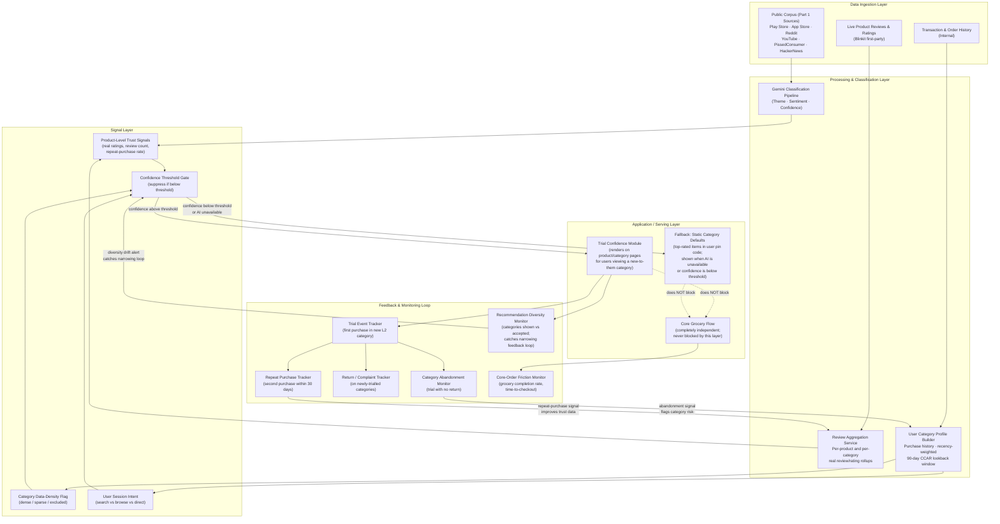

# Architecture: Trial Confidence Layer for Cross-Category Adoption

## 1. Solution Concept

**Root cause (per ProblemStatement.md):** Trying a new category on Blinkit is a high-risk, low-information, fee-penalised decision — and the cost of a bad first trial is permanent category closure.

**The MVP — "Trial Confidence" layer** — is the direct counter to this root cause. It de-risks a user's first trial of a new category at the exact moment of decision by surfacing credible peer evidence on product and category pages. Per Pattern B in ProblemStatement.md, respondents explicitly rejected platform-generated suggestions (R1: "good reviews on the specific product she is considering, not generic suggestions"); what they demanded was real social proof from other buyers. The Trial Confidence layer delivers exactly that: real review summaries, real ratings, and real repeat-purchase signals drawn from verified transaction and review data — never LLM-generated text presented as a user quote.

**What this MVP addresses:**
*   **Information vacuum at the decision point (Force 1, ProblemStatement.md):** The layer fills the gap by presenting peer evidence where it is currently absent — on the product page, at the moment of consideration.
*   **Asymmetric downside (Force 2, ProblemStatement.md):** By enabling users to make better-informed category decisions, the layer reduces the probability of a bad first trial, directly mitigating the permanent-closure asymmetry documented in Pattern A.

**What this MVP deliberately does not attempt to solve:**
*   **Fee economics (Force 3, ProblemStatement.md):** Fee restructuring is finance-owned and out of scope. The architecture is designed to work within the current fee structure; if fees are later reduced on trial baskets, the two interventions compound rather than conflict.
*   **Structural bypass of discovery surfaces (Force 4, ProblemStatement.md):** Because users arrive in intent mode (R1 never notices banners, R2 goes straight to search — per Pattern E), the Trial Confidence layer does not rely on homepage banners or push notifications. Instead, it surfaces within the product/category page the user has already navigated to, meeting the user where they already are. This sidesteps the bypass problem rather than solving it — discovery of new categories still depends on the user arriving at a non-grocery page through search, a deep link, or an organic trigger.

## 2. System Diagram

**Key architectural decisions visible in the diagram:**

*   **Core grocery isolation.** The core grocery flow (D3) has no dependency on the Trial Confidence module. Per the latency/reliability failure mode in EdgeCases.md, if the AI call fails, the module collapses silently; the grocery checkout is never blocked.
*   **Confidence threshold gate.** Per the cold-start and false-confidence failure modes in EdgeCases.md, a signal below the threshold routes to static fallback defaults (D2) rather than rendering a shaky recommendation as if it were confident.
*   **Recommendation diversity monitor (E5).** Per the recommendation-narrowing failure mode in EdgeCases.md, this component explicitly tracks whether the system is reinforcing existing category habits rather than surfacing genuinely novel categories. If diversity of categories shown versus accepted drops below a threshold, it signals the confidence gate (C4) to rebalance.
*   **Feedback loop closes on real transactions, not clicks.** Per ProblemStatement.md's north star metric rationale, the system learns from purchases (E1, E2), not from impressions, to avoid inflating engagement metrics with non-converting activity.

## 3. Signals Table

| Signal | Source | Why It Matters |
| :--- | :--- | :--- |
| **User category purchase history** (recency-weighted, 90-day lookback) | Internal transaction data | Directly tied to the CCAR north star metric in ProblemStatement.md. Determines whether a category is "new" to the user. Recency weighting ensures a lapsed category is treated as a re-activation opportunity, not a habitual one. |
| **Product-level review/rating data** | Blinkit first-party reviews; verified purchase reviews | Per Pattern B (ProblemStatement.md), the only trust currency users accept is peer evidence. This data must be real and retrievable — never generated — per the hallucination failure mode in EdgeCases.md. |
| **Category repeat-purchase rate** | Internal transaction data (second purchase within 30 days of first trial) | Per ProblemStatement.md's supporting metrics, the second-purchase rate is "the real test." Given Pattern A (first-experience determinism), a trial without repeat means the category is likely burned. |
| **Category data-density flag** | Derived from corpus mention counts (category_coverage.csv) and first-party review volume | Per EdgeCases.md's sparse-category failure mode: electronics (509 mentions) and personal_care_beauty (233) are dense enough for launch; pet (23), intimate_personal (21), and home_cleaning (32) are too sparse. Categories flagged as sparse are excluded from AI-generated signals and served only static defaults. |
| **User session intent** | In-session behavioural signal (search query vs. category browse vs. direct navigation) | Per Pattern E (ProblemStatement.md), most users are in intent mode — they search or navigate directly, never browsing the homepage. The module must render within the flow the user is already in, not compete for attention on a surface they are ignoring. |
| **Confidence threshold** | Model-internal calibration score | Per the cold-start and false-confidence failure modes in EdgeCases.md: if the system's confidence in a recommendation or trust signal falls below the threshold, the user sees a neutral state (static defaults or no recommendation) rather than a low-quality output presented as certain. |

## 4. Component Responsibilities and Tech Choices

| Component | Responsibility | Tech Choice | Rationale |
| :--- | :--- | :--- | :--- |
| **Classification Pipeline** | Ingests public corpus and first-party reviews; classifies by theme, sentiment, and confidence score | Gemini API (reused from Part 1) | Already built, validated, and tuned for this corpus. Reusing it avoids cold-starting a new classification model. |
| **Review Aggregation Service** | Computes per-product and per-category trust signal rollups (average rating, review count, repeat-purchase rate) from verified first-party data | Scheduled batch job writing to a low-latency key-value store (e.g., Cloud Firestore or Redis) | Trust signals change slowly (daily cadence is sufficient), so a batch-to-cache architecture avoids real-time LLM calls on the critical path — directly mitigating the latency risk from EdgeCases.md. |
| **User Category Profile Builder** | Maintains each user's category purchase history with recency weighting and the 90-day lookback window tied to CCAR | Event-driven pipeline consuming order events, writing to a user profile store | Must be near-real-time so that a trial purchase immediately updates the user's profile and prevents the system from re-recommending a category the user just bought. |
| **Serving Layer (Trial Confidence Module)** | Renders trust signals on product/category pages for users viewing a category that is new to them | Lightweight front-end component fetching pre-computed signals from the cache; no synchronous LLM call at render time | Eliminates the latency failure mode. The module reads from pre-computed data, never waits for a live model inference. If the cache is empty or the data-density flag is "sparse," the module falls back to static defaults or collapses. |
| **Monitoring Dashboard** | Tracks the guardrail metrics from ProblemStatement.md: category-abandonment rate, core-order friction (grocery completion rate, time-to-checkout), return/complaint rate on newly-trialled categories, and recommendation diversity | Looker or Metabase dashboards connected to the analytics warehouse | These are the metrics that determine whether the MVP is helping or harming. The dashboard must have automated alerts: a spike in category-abandonment rate (per ProblemStatement.md, "worse than no intervention") triggers an immediate review. |

## 5. Mitigation Mapping: EdgeCases.md Failure Modes

| Failure Mode (EdgeCases.md) | Mitigating Component / Design Choice |
| :--- | :--- |
| **Hallucination of trust signals** | The serving layer renders only pre-computed, verified review/rating data from the Review Aggregation Service. No LLM generates text presented as a user quote or fabricates a numeric rating. All trust signals are retrieval-based, never generative. |
| **Cold-start problem** | The confidence threshold gate routes low-data users to static category-level defaults (top-rated items in the user's pin code). The UI explicitly shows a neutral state rather than a low-confidence guess disguised as a personalised recommendation. |
| **Recommendation feedback loop / narrowing** | The Recommendation Diversity Monitor (E5 in the diagram) tracks the ratio of novel categories shown versus accepted per user per session. If diversity drops below a configurable floor, the confidence gate rebalances toward underexposed categories. The algorithm is constrained to always include novel-category items, not just historically engaged categories. |
| **False confidence / miscalibration** | The classification pipeline's confidence scores are subject to periodic manual QA — both a random sample across confidence levels and a targeted review of the lowest-confidence bucket. Recalibration happens before confidence thresholds are used to gate which categories enter the MVP's scope. |
| **Adversarial / manipulated input** | **Known limitation.** The current MVP architecture does not include a user-facing conversational agent, which eliminates the primary prompt-injection surface. If a chat-based discovery assistant is added later, it must operate within a fixed, read-only toolset with input sanitisation and rate limits, as specified in EdgeCases.md. This is deferred, not ignored. |
| **Failure to generalise across sparse categories** | The category data-density flag (Signal Layer) gates which categories receive AI-generated trust signals. Categories with fewer than ~50 corpus mentions (pet: 23, intimate_personal: 21, home_cleaning: 32 — per category_coverage.csv) are excluded from AI-powered signals at launch and served only static defaults. Category-level launch is phased, starting with electronics and personal_care_beauty. |
| **Latency / production reliability risk** | The serving layer reads from a pre-computed cache, not a synchronous LLM call. If the cache is unavailable, the Trial Confidence module collapses silently. The core grocery checkout flow (D3 in the diagram) has zero dependency on this layer and is never blocked. |

## 6. Competitive Moat

This architecture compounds over time. Every real trial purchase generates a new data point in the User Category Profile Builder and the Review Aggregation Service. Every repeat purchase within 30 days strengthens the per-product trust signal for future users considering the same category. Every abandonment event sharpens the system's understanding of which categories or products are not yet ready for AI-powered recommendation. This means the signal layer becomes richer with every user interaction — a proprietary data asset that sits underneath the feature. A competitor could ship a visually identical "trust badge" on their product pages, but without Blinkit's existing transaction volume, first-party review density, and the compounding feedback loop between trial events and signal quality, their version would be hollow. Per ProblemStatement.md's data-flywheel argument, the moat is not the feature; the moat is the data graph that makes the feature credible — and that graph grows with every cross-category activation the system enables.
